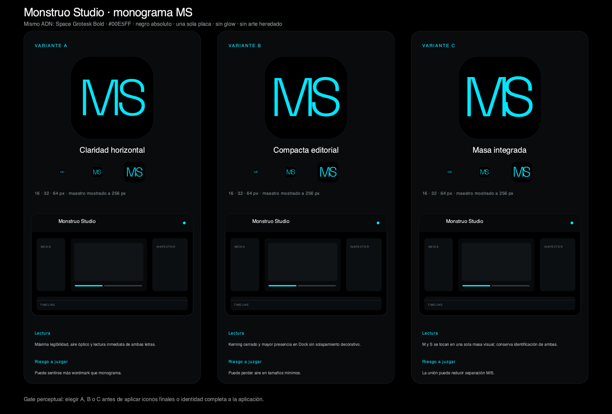
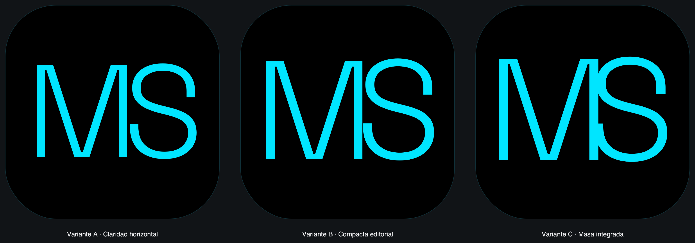
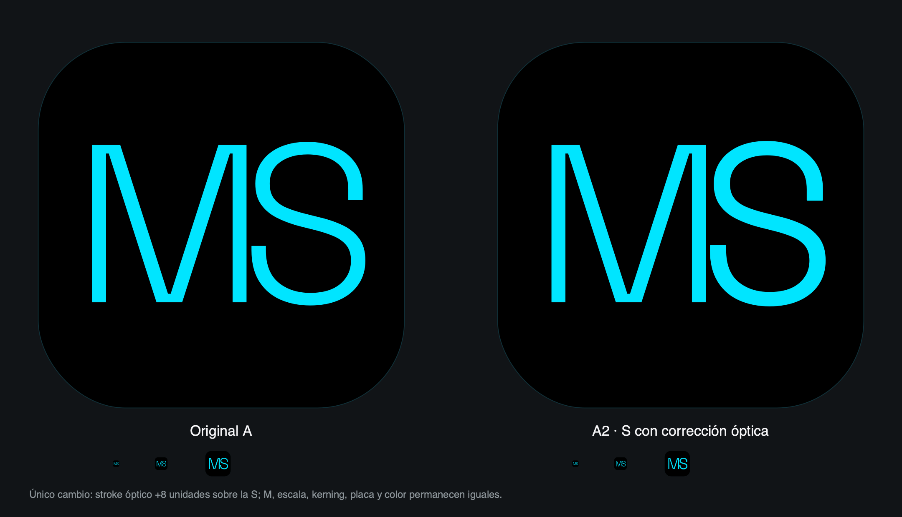

# Gate perceptual — monograma MS de Monstruo Studio

**Estado final:** Alfredo señaló **A** como la dirección correcta y detectó que la S se percibía más ligera que la M. Se produjo **A2**, una corrección óptica focalizada. Ante la instrucción posterior «hazlo tú», P16 asumió el juicio delegado, midió la geometría y seleccionó **A2** como maestro de producción.

## Opciones

| Variante | Intención | Fortaleza | Riesgo perceptual |
|---|---|---|---|
| **A — Claridad horizontal** | Máxima legibilidad y aire óptico | Lectura más robusta en 16 px | Puede sentirse más wordmark que monograma |
| **B — Compacta editorial** | Identidad compacta sin solapamiento | Equilibrio entre lectura y presencia en Dock | Menos aire que A |
| **C — Masa integrada** | Una sola masa visual tocando M y S | Mayor carácter de monograma | La unión exige más juicio a 16 px |

Las tres usan la M canónica de El Monstruo y una S del mismo Space Grotesk Bold 700. Ninguna contiene monstruo literal, cerebro, cámara, claqueta, película, play, timeline, nodos, mosaico, engrane, collage, glow, segunda placa o imagen embebida.

## Escala 1024 px

## Corrección óptica de A

A2 conserva íntegramente la M, la escala, el kerning, la placa, la posición y el color de A. El único cambio es un stroke óptico de 8 unidades del espacio de la fuente aplicado a la S, equivalente aproximadamente a un 14% adicional sobre su trazo nominal. Esto compensa la pérdida perceptual propia de las curvas sin convertir la S en otra familia ni deformarla.

## Estado

- SVG maestros: completos.
- Pruebas visuales: 16, 32, 64, 256 y 1024 px.
- Mockup dentro del shell: completo.
- Aplicación funcional: **identidad A2 implementada y validada en build aislada e instalación separada**.
- Gate: **CERRADO — A2**.

Los iconos PNG/ICNS/ICO, splash, Welcome, shell, Settings/About y paquete macOS se derivaron del SVG A2 único. La revisión real confirmó que la corrección balancea la S frente a la M sin volverla tosca ni romper legibilidad en tamaños pequeños.
